# Class Diagram

How the classes in `src/main/java/com/notifications` relate to one another. See
[`README.md`](README.md) for the request/response-level architecture walkthrough — this file
is the class-level companion to it.

## Legend

| Notation | Meaning |
|---|---|
| `Interface <\|.. Impl` | `Impl` implements `Interface` |
| `Parent <\|-- Child` | `Child` extends `Parent` |
| `A o-- B` | `A` holds a reference to `B` (aggregation) |
| `A *-- B` | `A` owns `B`'s lifecycle (composition) |
| `A ..> B : verb` | `A` depends on / calls / creates `B` |

## Diagram

```mermaid
classDiagram
    direction LR

    %% ===================== REST layer =====================
    class NotificationController {
        +create(NotificationRequest) NotificationCreatedResponse
        +get(String notificationId) NotificationStatusResponse
    }
    class PreferenceController {
        +put(String userId, PreferenceRequest) PreferenceResponse
        +get(String userId) List~PreferenceResponse~
    }
    class DlqController {
        +list() List~DlqEntryResponse~
        +replay(String deliveryId)
    }

    %% ===================== Orchestration / service layer =====================
    class NotificationService {
        -NotificationRepository notificationRepository
        -NotificationDeliveryRepository deliveryRepository
        -NotificationRouter router
        -DeliveryPublisher publisher
        +createNotification(NotificationRequest) Notification
        +getNotification(String) Notification
        +getDeliveries(String) List~NotificationDelivery~
    }
    class PreferenceService {
        -UserPreferenceRepository preferenceRepository
        +setPreference(String userId, PreferenceRequest) UserPreference
        +getPreferences(String userId) List~UserPreference~
    }
    class NotificationStatusAggregator {
        +aggregate(List~NotificationDelivery~) NotificationStatus
    }

    NotificationController --> NotificationService : delegates to
    NotificationController --> NotificationStatusAggregator : derives status
    PreferenceController --> PreferenceService : delegates to
    DlqController --> DlqService : delegates to

    NotificationService --> NotificationRepository
    NotificationService --> NotificationDeliveryRepository
    NotificationService --> NotificationRouter : resolves channels
    NotificationService --> DeliveryPublisher : publishes after commit
    NotificationService ..> Notification : creates
    NotificationService ..> NotificationDelivery : creates one per channel
    PreferenceService --> UserPreferenceRepository
    NotificationStatusAggregator ..> NotificationDelivery : reads

    %% ===================== Routing =====================
    class NotificationRouter {
        <<interface>>
        +getRoutes(String userId, String type) List~Channel~
    }
    class PreferenceBasedNotificationRouter {
        -UserPreferenceRepository preferenceRepository
        +getRoutes(String userId, String type) List~Channel~
    }
    NotificationRouter <|.. PreferenceBasedNotificationRouter
    PreferenceBasedNotificationRouter --> UserPreferenceRepository

    %% ===================== Domain entities =====================
    class Notification {
        +String id
        +String userId
        +String type
        +Map~String,String~ payload
        +Instant createdAt
    }
    class NotificationDelivery {
        +String id
        +String notificationId
        +String userId
        +Channel channel
        +DeliveryStatus status
        +int attemptCount
        +Instant nextAttemptAt
        +String lastError
        +Map~String,String~ payload
    }
    class UserPreference {
        +String userId
        +String notificationType
        +Set~Channel~ channels
    }
    class DeadLetterEntry {
        +String deliveryId
        +String notificationId
        +Channel channel
        +String failureReason
        +int attemptCount
    }
    class Channel {
        <<enumeration>>
        EMAIL
        SMS
        PUSH
    }
    class DeliveryStatus {
        <<enumeration>>
        PENDING
        DISPATCHING
        RETRYING
        DELIVERED
        FAILED
        EXHAUSTED
    }

    Notification "1" *-- "many" NotificationDelivery : notificationId (fan-out)
    NotificationDelivery --> Channel
    NotificationDelivery --> DeliveryStatus
    DeadLetterEntry ..> NotificationDelivery : deliveryId
    UserPreference --> Channel : channels

    %% ===================== Dispatch pipeline (the async consumer side) =====================
    class DeliveryPublisher {
        -BlockingQueue~String~ queue
        -DeliveryDispatchService dispatchService
        +publish(String deliveryId)
    }
    class DeliveryDispatchService {
        -NotificationDeliveryRepository deliveryRepository
        -NotificationSenderFactory senderFactory
        -RetryPolicyRegistry retryPolicyRegistry
        -DlqService dlqService
        +process(String deliveryId)
    }
    class DeliveryReconciliationScheduler {
        -NotificationDeliveryRepository deliveryRepository
        -DeliveryPublisher publisher
        +reconcile()
    }
    class DlqService {
        -DeadLetterEntryRepository dlqRepository
        -NotificationDeliveryRepository deliveryRepository
        -DeliveryPublisher publisher
        +record(NotificationDelivery, String reason)
        +listAll() List~DeadLetterEntry~
        +replay(String deliveryId)
    }

    DeliveryPublisher --> DeliveryDispatchService : hands off deliveryId
    DeliveryReconciliationScheduler --> NotificationDeliveryRepository : finds due/stuck deliveries
    DeliveryReconciliationScheduler --> DeliveryPublisher : republishes
    DeliveryDispatchService --> NotificationDeliveryRepository
    DeliveryDispatchService --> NotificationSenderFactory : gets composed sender
    DeliveryDispatchService --> RetryPolicyRegistry : per-channel policy
    DeliveryDispatchService --> DlqService : records terminal failures
    DlqService --> DeadLetterEntryRepository
    DlqService --> NotificationDeliveryRepository
    DlqService ..> DeliveryPublisher : republish on replay (lazy, breaks cycle)

    %% ===================== Sender strategy + decorators =====================
    class NotificationSender {
        <<interface>>
        +send(NotificationDelivery) SendResult
    }
    class EmailSender {
        +send(NotificationDelivery) SendResult
    }
    class SmsSender {
        +send(NotificationDelivery) SendResult
    }
    class PushSender {
        +send(NotificationDelivery) SendResult
    }
    class LoggingSender {
        -NotificationSender delegate
        +send(NotificationDelivery) SendResult
    }
    class RateLimitedSender {
        -NotificationSender delegate
        -RateLimiter rateLimiter
        +send(NotificationDelivery) SendResult
    }
    class NotificationSenderFactory {
        -Map~Channel,NotificationSender~ senders
        +getSender(Channel) NotificationSender
    }
    class SendException {
        <<abstract>>
        +Failure failure
    }
    class RetryableSendException
    class NonRetryableSendException
    class RateLimitExceededException

    NotificationSender <|.. EmailSender
    NotificationSender <|.. SmsSender
    NotificationSender <|.. PushSender
    NotificationSender <|.. LoggingSender
    NotificationSender <|.. RateLimitedSender
    LoggingSender o-- NotificationSender : wraps (delegate)
    RateLimitedSender o-- NotificationSender : wraps (delegate)
    RateLimitedSender --> RateLimiter : checks before delegating
    NotificationSenderFactory o-- NotificationSender : Channel to decorated sender
    SendException <|-- RetryableSendException
    SendException <|-- NonRetryableSendException
    EmailSender ..> SendException : throws
    SmsSender ..> SendException : throws
    PushSender ..> SendException : throws
    RateLimitedSender ..> RateLimitExceededException : throws (not a SendException)

    %% ===================== Rate limiting =====================
    class RateLimiter {
        <<interface>>
        +allow(RateLimitKey) boolean
    }
    class TokenBucketRateLimiter {
        -Map~RateLimitKey,TokenBucket~ buckets
        -RateLimiterProperties properties
        +allow(RateLimitKey) boolean
    }
    class RateLimitKey {
        +String scope
        +String value
    }

    RateLimiter <|.. TokenBucketRateLimiter
    TokenBucketRateLimiter --> RateLimitKey
    TokenBucketRateLimiter --> RateLimiterProperties

    %% ===================== Retry policy =====================
    class RetryPolicy {
        <<interface>>
        +shouldRetry(int attempt, Failure) boolean
        +nextBackoff(int attempt) Duration
    }
    class ExponentialBackoffRetryPolicy {
        -int maxRetries
        -Duration initialBackoff
        -double multiplier
        +shouldRetry(int attempt, Failure) boolean
        +nextBackoff(int attempt) Duration
    }
    class RetryPolicyRegistry {
        -Map~Channel,RetryPolicy~ policies
        +get(Channel) RetryPolicy
    }

    RetryPolicy <|.. ExponentialBackoffRetryPolicy
    RetryPolicyRegistry o-- RetryPolicy : one per channel
    RetryPolicyRegistry --> RetryProperties

    %% ===================== Wiring =====================
    class SenderConfig {
        +notificationSenderFactory(...) NotificationSenderFactory
    }
    SenderConfig ..> NotificationSenderFactory : builds
    SenderConfig ..> LoggingSender : composes Logging(RateLimited(raw))
    SenderConfig ..> RateLimitedSender : composes Logging(RateLimited(raw))
```

## Reading this alongside the design

- **Strategy** — `NotificationSender` has five implementations (`EmailSender`, `SmsSender`,
  `PushSender`, and the two decorators). `RetryPolicy` and `NotificationRouter` are the other
  two strategy interfaces in the system.
- **Factory** — `NotificationSenderFactory` is the only factory, and it's just a `Channel ->
  NotificationSender` map, built once by `SenderConfig`.
- **Decorator** — `LoggingSender` and `RateLimitedSender` both implement and wrap
  `NotificationSender`, so `NotificationSenderFactory` hands callers a `LoggingSender` whose
  `delegate` is a `RateLimitedSender` whose `delegate` is the raw channel sender — three objects,
  one interface.
- **The one deliberate cycle** — `DeliveryPublisher -> DeliveryDispatchService -> DlqService ->
  DeliveryPublisher` is real (the dispatcher needs to record failures via `DlqService`, and
  `DlqService.replay` needs to republish via `DeliveryPublisher`). It's broken with `@Lazy` on
  that last edge rather than restructured away, since restructuring it would mean introducing an
  abstraction with no other purpose than dodging the cycle.
