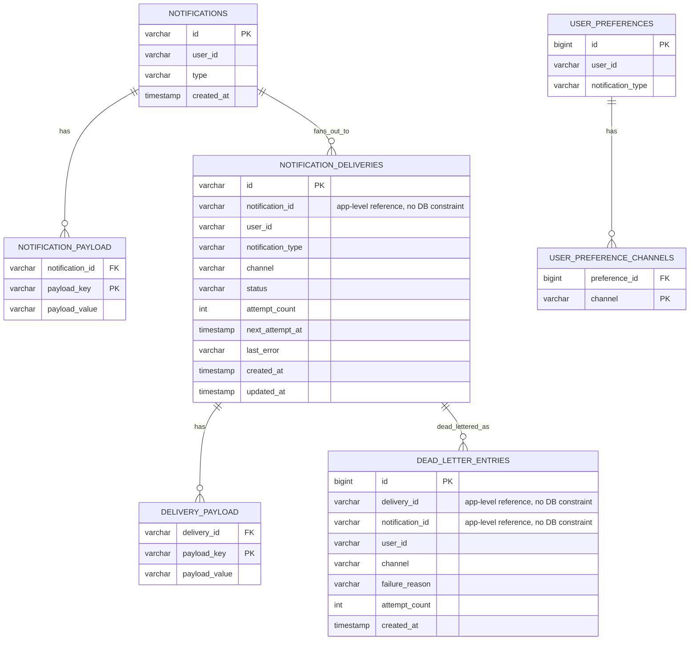

# Database Schema

There is no migration tool (Flyway/Liquibase) and no static `schema.sql` — every table below is
generated fresh on each application start by Hibernate (`spring.jpa.hibernate.ddl-auto:
create-drop` in `application.yml`), directly from the `@Entity` classes in
`com.notifications.entity`. This doc is the schema those classes produce; see
[`CLASS_DIAGRAM.md`](CLASS_DIAGRAM.md) for how those same entity classes relate to the rest of
the code, and [`REQUIREMENTS.md`](REQUIREMENTS.md#explicit-non-goals) for why a migration tool
was intentionally left out.

## Contents

- [Entity-relationship diagram](#entity-relationship-diagram)
- [Tables](#tables)
- [Design notes](#design-notes)
- [Worked example: rows created by one request](#worked-example-rows-created-by-one-request)
- [Regenerating this document](#regenerating-this-document)

## Entity-relationship diagram



The `fans_out_to` and `dead_lettered_as` relationships are drawn here for readability, but — as
called out per-table below — they are **not** real foreign keys in the database. Only the three
`_PAYLOAD`/`_CHANNELS` element-collection tables have an actual DB-level `FOREIGN KEY`
constraint back to their owner.

## Tables

### `notifications`

Backs the `Notification` entity. One row per `POST /notifications` request
(see [`API.md § Create Notification`](API.md#1-create-notification)).

| Column | Type | Nullable | Notes |
|---|---|---|---|
| `id` | `varchar(255)` | No | **Primary key.** App-assigned UUID string (`UUID.randomUUID()`), not DB-generated. |
| `user_id` | `varchar(255)` | No | |
| `type` | `varchar(255)` | No | Free-form notification type string, e.g. `ORDER_SHIPPED`. |
| `created_at` | `timestamp(6) with time zone` | No | |

### `notification_payload`

Element-collection table backing `Notification.payload` (`Map<String, String>`). Not a
standalone entity — has no `id` of its own.

| Column | Type | Nullable | Notes |
|---|---|---|---|
| `notification_id` | `varchar(255)` | No | **FK** → `notifications.id`, DB-enforced (constraint `FKontqc1m5tedyrx56plwqmd8ww`). |
| `payload_key` | `varchar(255)` | No | Map key. |
| `payload_value` | `varchar(2000)` | Yes | Map value. |

**Primary key:** composite `(notification_id, payload_key)`.

### `notification_deliveries`

Backs the `NotificationDelivery` entity — one row per channel resolved for a notification. The
most heavily-accessed table in the system; see `DeliveryDispatchService` in
[`CLASS_DIAGRAM.md`](CLASS_DIAGRAM.md) for what reads/writes it.

| Column | Type | Nullable | Notes |
|---|---|---|---|
| `id` | `varchar(255)` | No | **Primary key.** App-assigned UUID string. This is the `deliveryId` in `API.md`. |
| `notification_id` | `varchar(255)` | No | References `notifications.id` **at the application level only** — see [Design notes](#design-notes). Indexed (`idx_delivery_notification_id`). |
| `user_id` | `varchar(255)` | No | Denormalized from the parent `Notification`, so rate limiting/routing don't need a join. |
| `notification_type` | `varchar(255)` | No | Denormalized from the parent `Notification`. |
| `channel` | `enum('EMAIL','PUSH','SMS')` | No | Native H2 enum, backed by `Channel`. |
| `status` | `enum('DELIVERED','DISPATCHING','EXHAUSTED','FAILED','PENDING','RETRYING')` | No | Backed by `DeliveryStatus`. Indexed (`idx_delivery_status`) — this is what `DeliveryReconciliationScheduler` scans by. |
| `attempt_count` | `integer` | No | Default `0`. Only incremented after a real provider call — see the retry/rate-limit explanation linked in [Design notes](#design-notes). |
| `next_attempt_at` | `timestamp(6) with time zone` | Yes | `null` unless `status = RETRYING`. |
| `last_error` | `varchar(2000)` | Yes | Message from the most recent failure. |
| `created_at` | `timestamp(6) with time zone` | No | |
| `updated_at` | `timestamp(6) with time zone` | No | |

**Indexes:** `idx_delivery_notification_id (notification_id)`, `idx_delivery_status (status)`.

### `delivery_payload`

Element-collection table backing `NotificationDelivery.payload` — a denormalized snapshot of
the parent notification's payload at delivery-creation time (including any `simulate` /
`simulate.<CHANNEL>` testing keys — see [`README.md`](README.md#controlling-delivery-outcomes-for-testing)).

| Column | Type | Nullable | Notes |
|---|---|---|---|
| `delivery_id` | `varchar(255)` | No | **FK** → `notification_deliveries.id`, DB-enforced (constraint `FKhp5x8ol0kshbatj1i0b6uec9f`). |
| `payload_key` | `varchar(255)` | No | Map key. |
| `payload_value` | `varchar(2000)` | Yes | Map value. |

**Primary key:** composite `(delivery_id, payload_key)`.

### `dead_letter_entries`

Backs the `DeadLetterEntry` entity, written by `DlqService.record`. A given `delivery_id` can
appear more than once here — each terminal failure (including one caused by a
[replay](API.md#6-replay-a-dlq-entry)) adds a new row rather than overwriting the last one.

| Column | Type | Nullable | Notes |
|---|---|---|---|
| `id` | `bigint` | No | **Primary key.** DB-generated (`generated by default as identity`). |
| `delivery_id` | `varchar(255)` | No | References `notification_deliveries.id` **at the application level only**. |
| `notification_id` | `varchar(255)` | No | References `notifications.id` **at the application level only**. |
| `user_id` | `varchar(255)` | No | |
| `channel` | `enum('EMAIL','PUSH','SMS')` | No | |
| `failure_reason` | `varchar(2000)` | Yes | |
| `attempt_count` | `integer` | No | Attempt count at the moment this entry was recorded. |
| `created_at` | `timestamp(6) with time zone` | No | |

### `user_preferences`

Backs the `UserPreference` entity — one row per `(userId, notificationType)` pair a user has
configured via [`PUT /users/{userId}/preferences`](API.md#3-set-user-preference).

| Column | Type | Nullable | Notes |
|---|---|---|---|
| `id` | `bigint` | No | **Primary key.** DB-generated identity. |
| `user_id` | `varchar(255)` | No | |
| `notification_type` | `varchar(255)` | No | |

**Unique constraint:** `uk_user_preference_user_type (user_id, notification_type)` — this is
what makes "set preference" an upsert rather than an insert-only operation.

### `user_preference_channels`

Element-collection table backing `UserPreference.channels` (`Set<Channel>`).

| Column | Type | Nullable | Notes |
|---|---|---|---|
| `preference_id` | `bigint` | No | **FK** → `user_preferences.id`, DB-enforced (constraint `FKf4ur02dw8rtny7gq17sewm6mo`). |
| `channel` | `enum('EMAIL','PUSH','SMS')` | No | |

**Primary key:** composite `(preference_id, channel)` — which also means a preference can't
list the same channel twice.

## Design notes

- **`NotificationStatus` is never persisted.** There is no `status` column on `notifications`.
  `NotificationStatusAggregator` computes it on every read from the current
  `notification_deliveries.status` rows, so it can never drift out of sync with the deliveries it
  summarizes (see `REQUIREMENTS.md` NFR-8).
- **Cross-entity references are plain columns, not JPA relationships, by design.** `notification_id`
  on `notification_deliveries`, and `delivery_id`/`notification_id` on `dead_letter_entries`, are
  ordinary `varchar` columns rather than `@ManyToOne` associations — so there's no DB-level
  `FOREIGN KEY` enforcing them (confirmed in the generated DDL: only the three element-collection
  tables get an `alter table ... add constraint FK...`). This is deliberate: these entities are
  read independently along very different access paths (`DeliveryDispatchService` looks up a
  delivery by its own `id` and never needs to join back to `notifications`;
  `NotificationStatusAggregator` looks up deliveries by `notification_id` directly), and a mapped
  relationship would invite accidental N+1 fetches for a link nothing actually navigates as an
  object graph.
- **The three `_payload`/`_channels` tables are not full entities.** They exist only because
  `Notification.payload`, `NotificationDelivery.payload`, and `UserPreference.channels` are
  `@ElementCollection`s — Hibernate owns their schema entirely, they have no `id` column, and
  their primary key is the composite `(owner_id, key)` shown above.
- **Enum columns are native H2 `ENUM` types**, not free-text — `channel` is constrained to
  `EMAIL`/`PUSH`/`SMS` and `status` to the six `DeliveryStatus` values at the database level,
  via `@Enumerated(EnumType.STRING)`.
- **Primary keys use two different strategies.** `notifications.id` and
  `notification_deliveries.id` are UUID strings assigned by application code
  (`NotificationService.createNotification`) before the row is even sent to the database — this
  is what lets `NotificationService` know a delivery's final ID before publishing it. `dead_letter_entries.id`
  and `user_preferences.id` are ordinary DB-generated `IDENTITY` (auto-increment) longs, since
  nothing needs to know their ID ahead of the insert.

## Worked example: rows created by one request

```http
POST /notifications
{ "userId": "u-123", "type": "SECURITY_ALERT", "payload": { "orderId": "O-1" } }
```

...for a user with a preference of `["EMAIL", "SMS"]` for `SECURITY_ALERT`, results in:

| Table | Rows written |
|---|---|
| `notifications` | 1 row: `id=N1, user_id=u-123, type=SECURITY_ALERT` |
| `notification_payload` | 1 row: `(notification_id=N1, payload_key=orderId, payload_value=O-1)` |
| `notification_deliveries` | 2 rows: `id=D1, notification_id=N1, channel=EMAIL, status=PENDING` and `id=D2, notification_id=N1, channel=SMS, status=PENDING` |
| `delivery_payload` | 2 rows: `(delivery_id=D1, payload_key=orderId, ...)` and the same for `D2` — the payload is copied onto each delivery independently |

If `D2` (SMS) later exhausts its retry budget, one more row appears in `dead_letter_entries`
with `delivery_id=D2`; `notifications` and `notification_deliveries` are unaffected by that
insert, since `notification_deliveries.status` for `D2` is updated in place to `EXHAUSTED`
rather than duplicated.

## Regenerating this document

The DDL above was captured directly from Hibernate, not hand-written, so it can be regenerated
if the entity classes change:

```bash
./gradlew bootRun --args='--spring.jpa.properties.jakarta.persistence.schema-generation.scripts.action=create --spring.jpa.properties.jakarta.persistence.schema-generation.scripts.create-target=file:/tmp/schema-export.sql'
# then Ctrl-C once it's started, and read /tmp/schema-export.sql
```
